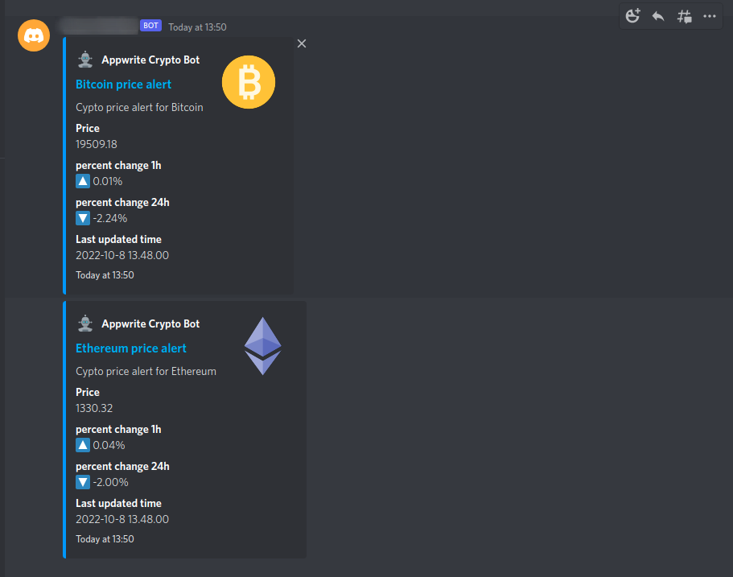
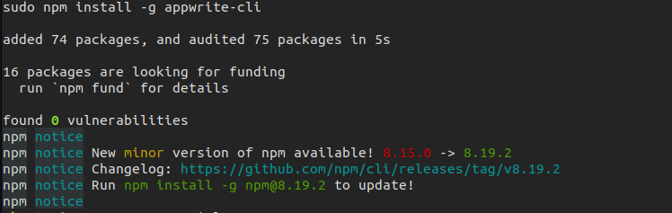
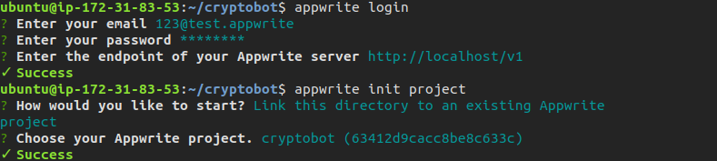
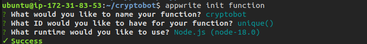
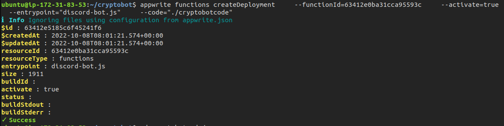
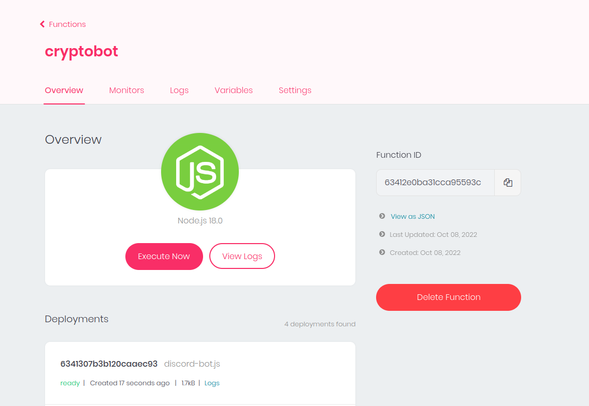
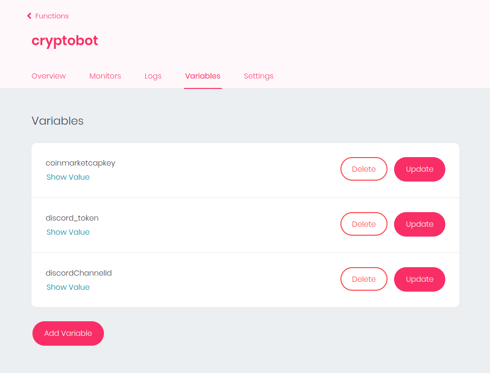
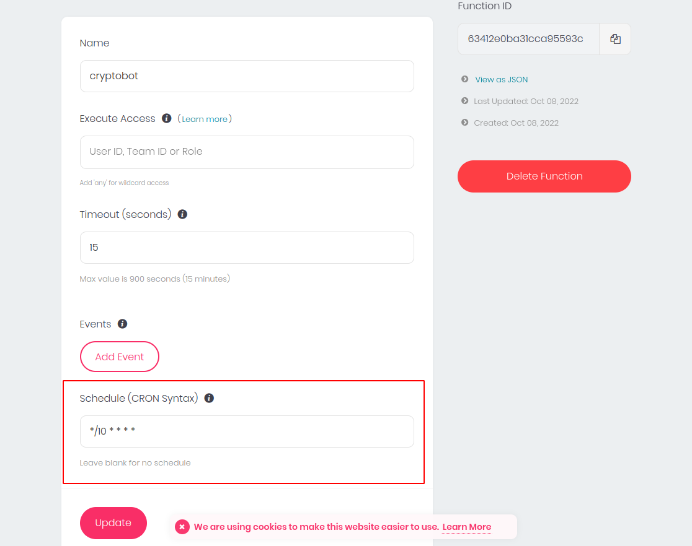
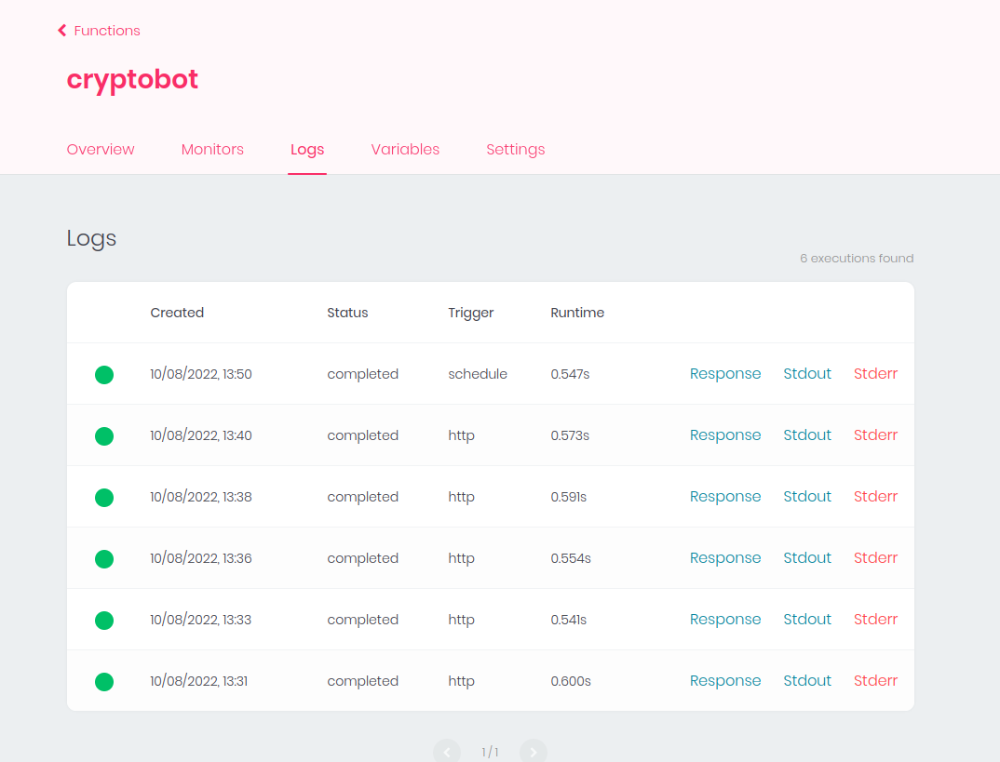

### Discord Crypto alert bot Powerd by appwrite

This appwrite function will send scheduled crypto price alerts to a [discord](https://discord.com/) channel  
using the [appwrite Functions](https://appwrite.io/docs/functions) feature.

## Appwrite function overview

> [Appwrite Functions](https://appwrite.io/docs/functions) allow you to extend and customize your Appwrite server functionality by executing your custom code. Appwrite can execute your custom code in response to any Appwrite system event like account creation, user login, or document update. You can also schedule your functions to run according to a CRON schedule or start them manually by triggering your function from an HTTP endpoint using the Appwrite client or server APIs. (Appwrite docs)

This appwrite function uses [CoinMarketCap API](https://coinmarketcap.com/api/) to get crypto prices and send embedded messages to the discord channel.
[discord.js npm package](https://discord.js.org/#/) to interact with discord API.
This Function uses nodejs 18 runtime and is triggered on scheduled cron every 10 minutes.
API keys and tokens are set in appwrite function variables for security.

## Setup

Set up appwrite on your server. i won't go into detail about this step since it is out of the scope of this demo.

for this function node version should be higher than 16.9 since that is the supported version by the [discord.js](https://discord.js.org/#/) npm package.
so i modified docker-compose .env variables to [add node 18 runtime](https://appwrite.io/docs/functions#supportedRuntimes)

`docker-compose.yml` and `.env` files are available in [appwrite directory](/appwrite/).

appwrite function code is available in [bot directory](/bot/).

### Install appwrite cli

`npm install -g appwrite-cli`

### Login to appwrite cli and init project

`appwrite login`

`appwrite init project`

### Create a function using appwrite cli

`appwrite init function`

### Deploy function

`appwrite functions createDeployment --functionId=63412e0ba31cca95593c --activate=true --entrypoint="discord-bot.js" --code="./cryptobotcode"`

make sure you have the code in the specified directory.
for node js [dont include node_modules](https://appwrite.io/docs/functions#ignoreFiles) folder since appwrite will automatically do it for you in the function
build process.

now login to appwrite dashboard

add function variables

update function schedule in function settings.
here `*/10 * * * *` is used to trigger function every 10 minutes

view function logs

